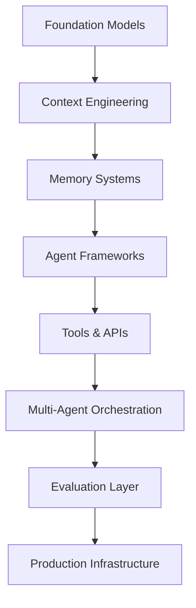

<div align="center">

# ⚡ AI Engineer • Agent Architect • Anti-Gravity Builder


### Building autonomous systems that think, reason, act, and scale.


</div>

---

# 🧠 About Me

I'm an AI Engineer focused on building **agentic systems** that move beyond chatbots.

My work revolves around:

- 🤖 Multi-Agent Architectures
- 🧠 LLM Systems Design
- ⚡ Retrieval-Augmented Generation (RAG)
- 🔄 Workflow Automation
- 🛠️ Tool Calling & Agent Orchestration
- 📈 Production AI Infrastructure
- 🚀 AI Product Development

I build systems that can:

```text
Observe → Reason → Plan → Act → Learn
```

---

# 🌌 The Anti-Gravity Stack

> Modern AI isn't built from the top down.
> It's built from intelligence outward.



---

# ⚡ Current AI Engineer Roadmap

```text
Level 1 ─ Prompt Engineering
        ↓
Level 2 ─ RAG Systems
        ↓
Level 3 ─ Agent Engineering
        ↓
Level 4 ─ Multi-Agent Systems
        ↓
Level 5 ─ AI Infrastructure
        ↓
Level 6 ─ Autonomous Products
```

---

# 🤖 Agent-First Philosophy

Traditional Software:

```text
User → Backend → Database → Response
```

Agent Systems:

```text
User
 ↓
Agent
 ↓
Reasoning
 ↓
Tools
 ↓
Memory
 ↓
Actions
 ↓
Outcome
```

The future belongs to software that can:

- Understand context
- Make decisions
- Use tools
- Execute workflows
- Collaborate with other agents

---

# 🔥 Tech Arsenal

## Foundation Models

<p>

</p>

### AI

- OpenAI
- Anthropic
- Gemini
- Open Source Models

### Agent Frameworks

- LangGraph
- CrewAI
- AutoGen
- DSPy
- LlamaIndex

### Infrastructure

- Docker
- Kubernetes
- PostgreSQL
- Redis
- Vector Databases

### Cloud

- AWS
- Azure
- GCP

---

# 🏗️ Reference Architecture

```text
                    USER
                      │
                      ▼
              ┌─────────────┐
              │ AI AGENT    │
              └──────┬──────┘
                     │
        ┌────────────┼────────────┐
        ▼            ▼            ▼

   MEMORY      KNOWLEDGE      TOOLS
   SYSTEM          RAG          APIs

        ▼            ▼            ▼

          REASONING ENGINE

                   ▼

              FINAL ACTION
```

---

# 📊 Engineering Focus

<table>
<tr>
<td>

### 🧠 Intelligence

- Agent Design
- Planning Systems
- Reasoning Loops
- Memory Architectures

</td>
<td>

### ⚡ Execution

- APIs
- Automation
- Tool Calling
- Workflow Engines

</td>
</tr>

<tr>
<td>

### 📚 Knowledge

- RAG
- Vector Search
- Embeddings
- Knowledge Graphs

</td>
<td>

### 🚀 Production

- Evaluation
- Monitoring
- CI/CD
- Observability

</td>
</tr>
</table>

---

# 🚀 Featured Projects

## 🤖 Autonomous Research Agent

```yaml
Capabilities:
  - Search
  - Summarize
  - Analyze
  - Generate Reports
```

---

## 🧠 Multi-Agent System

```yaml
Agents:
  - Planner
  - Researcher
  - Engineer
  - Reviewer
```

---

## 📚 Enterprise RAG Platform

```yaml
Features:
  - Hybrid Search
  - Citations
  - Agent Memory
  - Production Monitoring
```

---

# 📈 GitHub Analytics

<div align="center">


</div>

---

# 🎯 2025 Mission

```text
□ Build production-grade AI agents
□ Master LangGraph
□ Deploy multi-agent systems
□ Open source agent frameworks
□ Scale AI products to real users
□ Push the frontier of autonomous software
```

---

# 🌐 Connect

<div align="center">

[LinkedIn](https://linkedin.com/in/YOUR_HANDLE)
•
[Portfolio](https://yourwebsite.com)
•
[Twitter/X](https://x.com/YOUR_HANDLE)

</div>

---

<div align="center">

### "Software eats the world. Agents will operate it."

⚡ Building the future one agent at a time.

</div>
