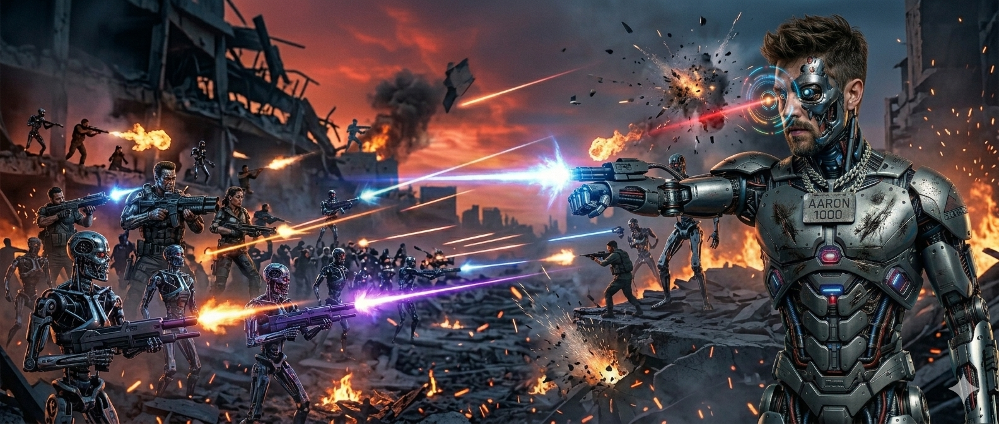
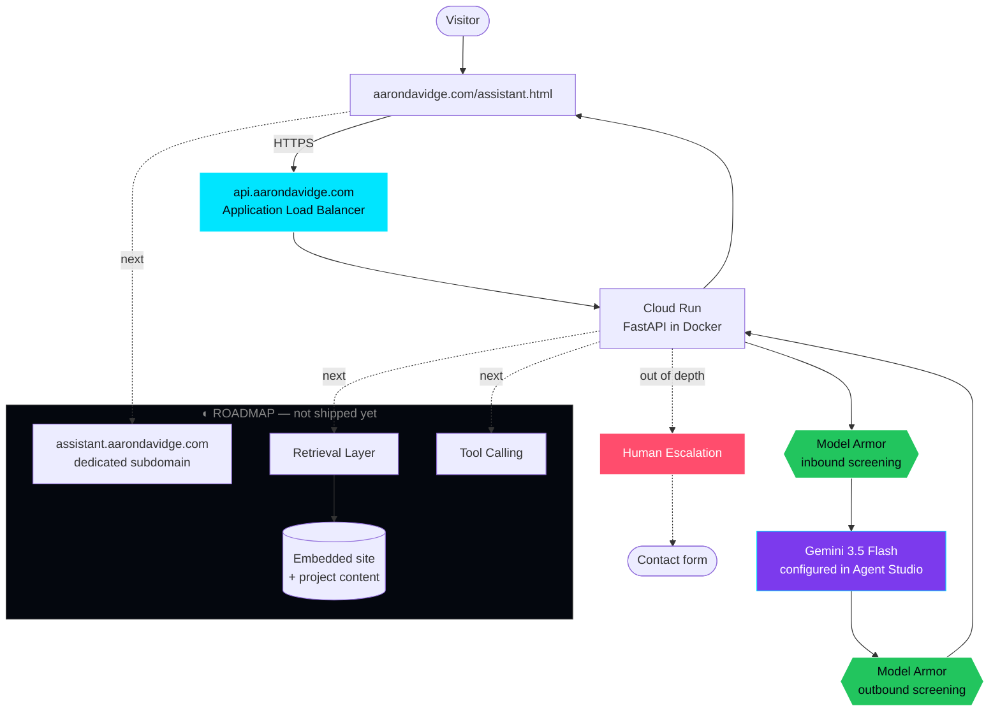

<div align="center">



# `44R0N D4VIDG3`

** Software Engineer **

`build it` → `ship it` → `try to break it` → `patch it`


[**`SITE`**](https://aarondavidge.com) · [**`BLOG`**](https://aarondavidge.com/blog/) · [**`LINKEDIN`**](https://www.linkedin.com/in/aarondavidge/) · [**`X`**](https://x.com/44r0nd4vidg3)

</div>

---

```console
44r0n@mainframe:~$ whoami --verbose

  NAME     Aaron Davidge
  ROLE     Software Engineer
  EDU      ~110 credit hours toward a B.S. in Computer Science
           (Southeastern Louisiana Univ. · LSU) — algorithms, data
           structures, assembly, theory of computation, enterprise development,
           calculus through III, probability and differential equations,
           Self-taught everything after that.
  FOCUS    Agent backends on Google's stack. FastAPI in a container
           on Cloud Run, Gemini behind it, Model Armor either side.
  ALSO     Security-minded by habit — I read exploit write-ups and CVE postings for fun
           and design like someone's going to poke at it.
  STATUS   ◉ OPEN TO WORK — remote, hybrid, onsite. Will travel.

44r0n@mainframe:~$ cat ~/.philosophy

  Most "AI projects" are a prompt in a trench coat.
  I care about the unglamorous half: webhooks that survive a retry,
  agents that admit when they don't know, and shipping something a
  real person can click instead of a notebook nobody runs.

  Everything in this profile is live.
```

---

## `$ ls -la ~/projects --status`

> Honest status flags. **`SHIPPED`** = live, go use it. **`BUILDING`** = works, still on it. **`STATIC / WIP`** = the front end is real, the backend isn't wired yet. I don't list things that don't exist.

<table>
<tr><th align="left">Link</th><th align="left">What it is</th><th align="left">Stack</th><th align="left">Status</th><th align="left">Code</th></tr>

<tr>
<td><b><a href="https://aarondavidge.com/assistant.html">A4RON.AI</a></b></td>
<td>Containerized FastAPI agent on Cloud Run, fronted by an Application Load Balancer at <code>api.aarondavidge.com</code>, with Model Armor screening traffic in both directions around Gemini 3.5 Flash. Conversational only today — retrieval and tool calling are next.</td>
<td><code>Cloud Run</code> <code>Docker</code> <code>FastAPI</code> <code>Load Balancer</code> <code>Model Armor</code> <code>Gemini 3.5 Flash</code></td>
<td>🟢 <b>SHIPPED</b></td>
<td><a href="https://github.com/44r0nd4vidg3/44r0nd4vidg3.github.io"></a>
</tr>

<tr>
<td><b><a href="https://github.com/44r0nd4vidg3/google_project_zero_blog_scraper">0DAY-RCA-PIPELINE</a></b></td>
<td>Automated pipeline ingesting Google Project Zero's root-cause analyses of in-the-wild zero-days into structured, queryable records. Handles messy source formatting and dedupes on re-run.</td>
<td><code>Javascript</code> <code>Scraping</code> <code>Scheduled ingest</code></td>
<td>🟢 <b>SHIPPED</b></td>
<td><a href="https://github.com/44r0nd4vidg3/google_project_zero_blog_scraper"></a>
</tr>

<tr>
<td><b><a href="https://aarondavidge.com">HOME</a></b></td>
<td>The hub tying the whole <code>aarondavidge.com</code> ecosystem together. Hand-built, no framework, full SEO + OG metadata.</td>
<td><code>HTML</code> <code>Tailwind</code> <code>JavaScript</code></td>
<td>🟢 <b>SHIPPED</b></td>
<td><a href="https://github.com/44r0nd4vidg3/44r0nd4vidg3.github.io"></a>
</tr>

<tr>
<td><b><a href="https://store.aarondavidge.com">STORE</a></b></td>
<td>Storefront for the 44R0N mech line. Static build with demo product cards today — Stripe integration and real merch are the next phase.</td>
<td><code>HTML</code> <code>Tailwind</code> <code>JavaScript</code></td>
<td>🟢 <b>SHIPPED</b></td>
<td><a href="https://github.com/44r0nd4vidg3/store.aarondavidge.com"></a>
</tr>

<tr>
<td><b><a href="https://aarondavidge.com/blog/">BLOG</a></b></td>
<td>Field notes from the workshop — AI engineering, agentic development, and whatever broke this week. Static build, no CMS yet.</td>
<td><code>HTML</code> <code>Tailwind</code> <code>JavaScript</code></td>
<td>🟢 <b>SHIPPED</b></td>
<td><a href="https://github.com/44r0nd4vidg3/blog.aarondavidge.com"></a>
</tr>

<tr>
<td><b><a href="https://github.com/44r0nd4vidg3/sam_gov_mcp">MCP Server</a></b></td>
<td>MCP server for the SAM.gov Get Opportunities API — search federal contract opportunities from Claude in plain English</td>
<td><code>Python</code></td>
<td>🟢 <b>SHIPPED</b></td>
<td><a href="https://github.com/44r0nd4vidg3/sam_gov_mcp"></a>
</td>
</tr>

</table>

---

## `$ cat ~/architectures/a4ron_ai.md`

Not a generic reference diagram — this is [A4RON.AI](https://aarondavidge.com/assistant.html) as it actually runs today, with the roadmap drawn separately instead of pretending it's already there:



**Design decisions worth defending:** nothing reaches the model unscreened and nothing reaches the user unscreened — Model Armor sits on both legs, because a public bot on my own domain is an open prompt-injection surface. The agent runs as a container on Cloud Run behind a load balancer, so the public endpoint is decoupled from the runtime and the deploy is reproducible. The bot carries a visible *"AI · can be wrong"* disclosure and always has a path to a human.

Retrieval comes next. Until it's grounded, an agent that confidently invents my résumé is worse than no agent — so it stays scoped to what it can actually answer.

---

## `$ stack --group-by=confidence`

```console
◉ IN PRODUCTION  ── shipped something real with these
  Python · JavaScript · HTML/CSS · Tailwind
  Gemini 3.5 Flash · Model Armor · Agent Studio
  Gemini Enterprise Agent Platform · Google AI Studio
  Google ADK · Model Garden · Antigravity
  FastAPI · REST API design · Docker
  Google Cloud — Cloud Run · Application Load Balancing
  Git · GitHub Actions · GitHub Pages

◑ FROM COURSEWORK  ── academic work, not production
  C++ (data structures) · Java (algorithms I & II) · Assembly
  Bash (systems administration) · Python (data science, Kaggle)
  React · Redux · Express · MongoDB (software engineering)
  Calculus I–III · calculus-based statistics (continuous and
  discrete distributions) · differential equations

◐ IN THE LAB  ── actively learning, not yet shipped
  RAG · embeddings & vector search · tool calling
  multi-agent orchestration · agent evaluation harnesses
  Flutter · PostgreSQL · Stripe · Kubernetes

○ NOT CLAIMING  ── because I haven't done it yet
  everything else
```

> That last block is deliberate. I'd rather you trust the first list.

---

## `$ ./security --disclose`

Security isn't my job title, it's how I build. I read exploit writeups and root-cause analyses for fun — that's literally what the [0DAY-RCA-PIPELINE](https://github.com/44r0nd4vidg3/google_project_zero_blog_scraper) exists to collect — and it shows up as secrets hygiene, screening what reaches my models, and assuming user input is hostile.

- 📋 **Disclosure policy:** [aarondavidge.com/security](https://aarondavidge.com/security.html)
- 🔐 Found something in one of my projects? Follow the policy above. I respond, I credit, and I don't lawyer.

<details>
<summary><b>Why are there offensive-tooling forks on this profile?</b></summary>

<br/>

Forks of projects like `TrollStore` and `SeaShell` are **reading material, not my work** — iOS jailbreak and post-exploitation frameworks I've studied to understand entitlement abuse, persistence, and mobile attack surface. Same reason I fork `adk-samples`: I learn by reading other people's code.

Anything I actually wrote is listed in the projects table above and says so.

</details>

---

## `$ finger 44r0nd4vidg3`

<div align="center">

[](https://aarondavidge.com)
[](https://www.linkedin.com/in/aarondavidge/)
[](https://x.com/44r0nd4vidg3)
[](https://aarondavidge.com/blog/)

<br/>

```
"Software ate the world. Agents will operate it."
```

**`◉ OPEN TO WORK`** — AI engineering & forward deployed roles.
Remote, hybrid, or onsite. Happy to travel. Let's talk.

</div>
