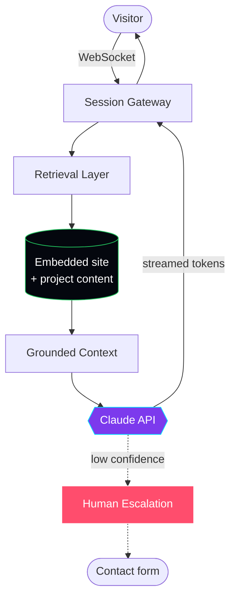

<div align="center">


# `44R0N D4VIDG3`

**AI ENGINEER // SECURITY RESEARCHER**

`build it` → `break it` → `patch it` → `ship it`


[**`SITE`**](https://aarondavidge.com) · [**`BLOG`**](https://aarondavidge.com/blog/) · [**`LINKEDIN`**](https://www.linkedin.com/in/aarondavidge/) · [**`X`**](https://x.com/44r0nd4vidg3)

</div>

---

```console
44r0n@mainframe:~$ whoami --verbose

  NAME     Aaron Davidge
  ROLE     AI Engineer · Security Researcher
  EDU      B.S. Computer Science, Minor in Mathematics
  FOCUS    Agents that do real work. Systems that survive contact with attackers.
  CREED    Ship the thing. Then try to break the thing.
  STATUS   ◉ OPEN TO WORK

44r0n@mainframe:~$ cat ~/.philosophy

  Most "AI projects" are a prompt in a trench coat.
  I care about the unglamorous half: retrieval that actually
  cites sources, webhooks that survive a retry, and knowing
  what your agent does when the model returns garbage.

  Everything in this profile is live. Click it. Break it.
  Tell me what you find — I'll thank you for it.
```

---

## `$ ls -la ~/projects --status`

> Honest status flags. **`SHIPPED`** means it's live and you can use it right now. **`BUILDING`** means it works but I'm still on it. I don't list things that don't exist.

<table>
<tr><th align="left">Project</th><th align="left">What it is</th><th align="left">Stack</th><th align="left">Status</th></tr>

<tr>
<td><b><a href="https://aarondavidge.com/assistant.html">A4RON.AI</a></b></td>
<td>Public-facing concierge agent. Answers questions about my work, retrieves from real site content, escalates to a human when it should.</td>
<td><code>Claude API</code> <code>RAG</code> <code>WebSockets</code> <code>Python</code></td>
<td>🟡 <b>BUILDING</b></td>
</tr>

<tr>
<td><b><a href="https://github.com/44r0nd4vidg3/google_root_cause_analysis_of_0days_in_the_wild">0DAY-RCA-PIPELINE</a></b></td>
<td>Automated pipeline ingesting Google Project Zero's root-cause analyses of in-the-wild zero-days into structured, queryable records. Handles messy source formatting and dedupes on re-run.</td>
<td><code>Python</code> <code>Scraping</code> <code>Scheduled ingest</code></td>
<td>🟢 <b>SHIPPED</b></td>
</tr>

<tr>
<td><b><a href="https://aarondavidge.com">HOME</a></b></td>
<td>The hub tying the whole <code>aarondavidge.com</code> ecosystem together. Hand-built, no framework, full SEO + OG metadata.</td>
<td><code>HTML</code> <code>Tailwind</code> <code>JavaScript</code></td>
<td>🟢 <b>SHIPPED</b></td>
</tr>

<tr>
<td><b><a href="https://store.aarondavidge.com">STORE</a></b></td>
<td>Real storefront for the 44R0N mech line. Catalog, cart, Stripe checkout, idempotent order writes so a replayed webhook can't double-charge.</td>
<td><code>Next.js</code> <code>Stripe</code> <code>PostgreSQL</code></td>
<td>🟡 <b>BUILDING</b></td>
</tr>

<tr>
<td><b><a href="https://aarondavidge.com/blog/">BLOG</a></b></td>
<td>Field notes from the workshop — AI engineering, agentic development, and whatever broke this week.</td>
<td><code>Astro</code> <code>MDX</code> <code>Tailwind</code></td>
<td>🟡 <b>BUILDING</b></td>
</tr>

</table>

---

## `$ cat ~/architectures/a4ron_ai.mmd`

Not a generic reference diagram — this is what actually runs behind [A4RON.AI](https://aarondavidge.com/assistant.html):



**Design decisions worth defending:** answers are grounded in retrieved content rather than model memory, tokens stream so perceived latency stays low, the bot carries a visible *"AI · can be wrong"* disclosure, and there's always a path to a human. An agent that confidently invents my résumé is worse than no agent.

---

## `$ stack --group-by=confidence`

```console
◉ IN PRODUCTION  ── shipped something real with these
  Python · JavaScript · TypeScript · SQL · HTML/CSS
  Claude API · RAG · embeddings & vector search · tool calling
  FastAPI · REST · PostgreSQL · WebSockets · Stripe API
  Next.js · Astro · Tailwind · Flutter
  Google Cloud (Vertex AI, Model Garden, Model Armor) · Google ADK
  Git · GitHub Actions · GitHub Pages · Docker

◐ IN THE LAB  ── actively learning, not yet shipped
  LangGraph · multi-agent orchestration · agent evaluation harnesses
  Kubernetes · Redis

○ NOT CLAIMING  ── because I haven't done it yet
  everything else
```

> That last block is deliberate. I'd rather you trust the first list.

---

## `$ ./security --disclose`

Half my time goes to security research: hunting bugs, hardening systems, and reporting findings the right way.

- 📋 **Disclosure policy:** [aarondavidge.com/disclosure](https://aarondavidge.com/disclosure.html)
- 🔐 Found something in one of my projects? Follow the policy above. I respond, I credit, and I don't lawyer.

<details>
<summary><b>Why are there offensive-tooling forks on this profile?</b></summary>

<br/>

Forks of projects like `TrollStore` and `SeaShell` are **reading material, not my work** — iOS jailbreak and post-exploitation frameworks I've studied to understand entitlement abuse, persistence, and mobile attack surface. Same reason I fork `adk-samples`: I learn by reading other people's code.

Anything I actually wrote is listed in the projects table above and says so.

</details>

---

## `$ finger 44r0nd4vidg3`

<div align="center">

[](https://aarondavidge.com)
[](https://www.linkedin.com/in/aarondavidge/)
[](https://x.com/44r0nd4vidg3)
[](https://aarondavidge.com/blog/)

<br/>

```
"Software ate the world. Agents will operate it."
```

**`◉ OPEN TO WORK`** — AI engineering roles. Let's talk.

</div>
